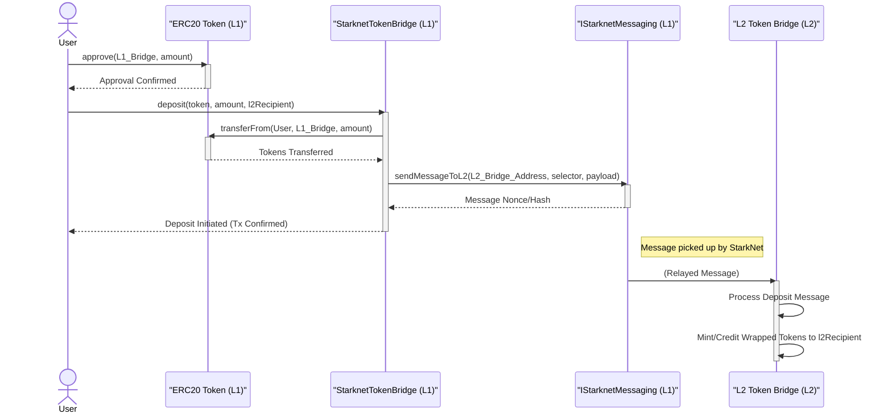
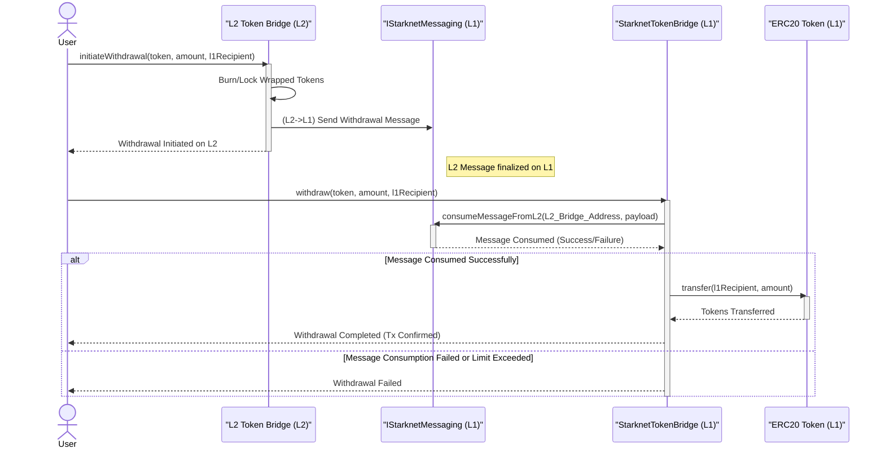
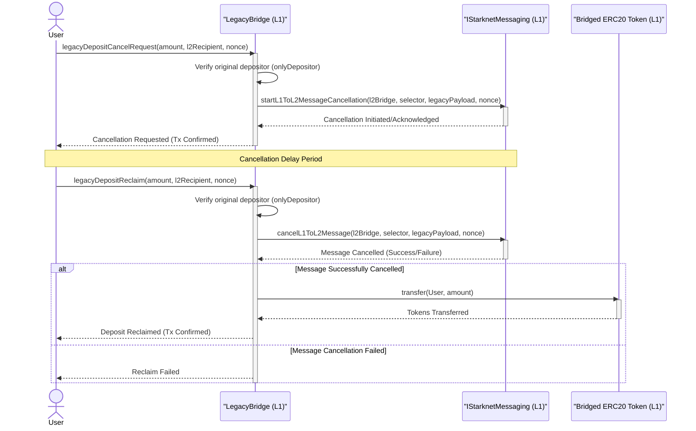

# StarkGate ERC20 Bridge Protocol Analysis Report

This report provides a comprehensive analysis of the StarkGate ERC20 bridging protocol, based on the examination of its Solidity smart contracts.

## 1. General Overview of the Protocol

The StarkGate ERC20 bridging protocol is designed to enable the secure and efficient transfer of ERC20 tokens between the Ethereum blockchain (Layer 1 or L1) and a StarkNet network (Layer 2 or L2). Its primary goal is to allow users to move their existing Ethereum assets onto StarkNet to interact with applications and benefit from StarkNet's scalability (higher throughput, lower gas fees), and then withdraw these assets back to Ethereum when desired.

**Key L1 Components:**
1.  **`StarknetTokenBridge`**: The primary L1 contract for bridging multiple ERC20s. Handles token enrollment, deposits (locking L1 tokens, messaging L2), and withdrawals (consuming L2 messages, releasing L1 tokens). Implements security features (balance/withdrawal limits) and is upgradable.
2.  **`LegacyBridge`/`StarknetERC20Bridge`**: Specialized L1 bridges (inheriting from `StarknetTokenBridge`) for specific legacy ERC20 tokens, ensuring backward compatibility for older bridge versions, especially in message formats for withdrawals and deposit management.
3.  **`StarkgateManager`**: Governs the L1 bridge system. Manages `StarknetTokenBridge` (enrollments, deactivations) and interacts with `StarkgateRegistry`.
4.  **`StarkgateRegistry`**: Maps ERC20 tokens to their responsible L1 bridge contracts.
5.  **`IStarknetMessaging`**: The official StarkNet L1 contract for all L1-L2 and L2-L1 message passing.
6.  **`StarknetTokenStorage`**: Abstract contract defining an upgrade-safe storage layout for bridge data.
7.  **Supporting Contracts/Libraries**: `Fees`, `WithdrawalLimit`, `StarkgateConstants`, `Felt252`.

**Key L2 Components (Implied):**
1.  **L2 Token Bridge Contract(s)**: Counterparts on StarkNet for each bridged token, handling minting/burning of wrapped tokens.
2.  **StarkNet Messaging Infrastructure**: Core L2 system for message dispatch and reception.

**Overall Architecture & Token Transfer Flow:**
The protocol uses a "lock-and-mint" (for deposits) and "burn-and-release" (for withdrawals) mechanism.
*   **Deposit (L1 to L2):** User locks ERC20 tokens in the L1 bridge, which sends a message to L2. The L2 bridge then mints corresponding wrapped tokens.
*   **Withdrawal (L2 to L1):** User initiates a burn of wrapped tokens on L2, which sends a message to L1. The L1 bridge consumes this message and releases the original ERC20 tokens.

The StarkGate bridge provides a secure and managed pathway for ERC20 token liquidity between Ethereum and StarkNet, crucial for the growth of the StarkNet DeFi ecosystem. It incorporates governance via `StarkgateManager` and upgradability using proxy patterns.

## 2. Smart Contract Analysis

### 2.1. `StarknetTokenBridge.sol`

**Explanation:**
The `StarknetTokenBridge.sol` contract is the core L1 component of the modern StarkGate system, acting as the primary L1 contract for bridging multiple, different ERC20 tokens between Ethereum (L1) and StarkNet (L2).

Its key responsibilities include:
*   **Token Onboarding (Enrollment):** Managing the process of registering new ERC20 tokens for bridging. This involves the `StarkgateManager` initiating enrollment, sending a deployment message to L2 to create the corresponding L2 token bridge/wrapper, and tracking the deployment status.
*   **Deposits:** Facilitating the transfer of ERC20 tokens from users on L1 to their specified recipients on L2. This includes handling the token transfer on L1, constructing the appropriate L1-L2 message, and sending it via the `IStarknetMessaging` contract. It supports simple deposits and deposits with an additional message payload.
*   **Withdrawals:** Processing withdrawals of tokens from L2 back to L1. This involves consuming a message from L2 (sent by the L2 bridge via `IStarknetMessaging`) and then transferring the corresponding tokens to the user on L1.
*   **Message Management:** Handling the lifecycle of L1-L2 messages, including cancellation and reclamation for deposits that users wish to retract before L2 processing.
*   **Security and Limits:** Enforcing `maxTotalBalance` per token and implementing optional withdrawal limits (`WithdrawalLimit.sol` library).
*   **State Management:** Maintaining the state of each bridged token (status, L2 deployment details, limits) via the inherited `StarknetTokenStorage`.
*   **Fee Handling:** Integrating with the `Fees` component.
*   **Upgradability:** Designed to work with a proxy system (`ProxySupport`).

**Functionality and Interactions Diagram:**

```mermaid
graph TD
    subgraph "User Layer"
        User(User/Caller)
    end

    subgraph "StarkGate L1 System"
        STB[StarknetTokenBridge]
        SGM[StarkgateManager]
        REG[StarkgateRegistry]
        SNS[StarknetTokenStorage]
        FeesLib[Fees Library/Contract]
        WLLib[WithdrawalLimit Library]
    end

    subgraph "External L1 Systems"
        ERC20(ERC20 Token Contract)
        SNM[IStarknetMessaging L1]
    end

    subgraph "StarkNet L2 (Conceptual)"
        L2Bridge(L2 Token Bridge)
    end

    %% Core Functionalities of StarknetTokenBridge
    STB -- "deposit(token, amount, l2Recipient)" --> STB_depositDetail["Locks ERC20 via ERC20.transferFrom\nSends L1->L2 message via SNM"]
    STB -- "depositWithMessage(token, amount, l2Recipient, message)" --> STB_depositMsgDetail["Locks ERC20 via ERC20.transferFrom\nSends L1->L2 message with payload via SNM"]
    STB -- "withdraw(token, amount, recipient)" --> STB_withdrawDetail["Consumes L2->L1 message via SNM\nTransfers ERC20 via ERC20.transfer"]
    STB -- "enrollToken(token) - Called by SGM" --> STB_enrollDetail["Sends L1->L2 deploy message via SNM\nUpdates token status in SNS"]
    STB -- "deactivate(token) - Called by SGM" --> STB_deactivateDetail["Updates token status in SNS"]
    STB -- "setL2TokenBridge(l2BridgeAddr)" --> STB_setL2Detail["Updates L2 bridge addr in SNS (AppGovernor)"]
    STB -- "setMaxTotalBalance(token, amount)" --> STB_setLimitsDetail["Updates token limits in SNS (AppGovernor)"]
    STB -- "enableWithdrawalLimit(token)" --> STB_enableWLLimit["Updates token settings in SNS (SecurityAgent)"]
    STB -- "depositCancelRequest(...)" --> STB_cancelReq["Starts L1->L2 message cancellation via SNM"]
    STB -- "depositReclaim(...)" --> STB_reclaim["Finalizes L1->L2 message cancellation via SNM\nTransfers ERC20 via ERC20.transfer"]

    %% Interactions
    User -- "Initiates deposit/withdraw" --> STB
    
    SGM -- "Manages STB" --> STB
    SGM -- "Uses" --> REG

    STB -- "Stores/Reads state" --> SNS
    STB -- "Uses for fee calculation" --> FeesLib
    STB -- "Uses for withdrawal limits" --> WLLib
    
    STB_depositDetail -- "interacts with" --> ERC20
    STB_depositDetail -- "sends message to" --> SNM
    STB_depositMsgDetail -- "interacts with" --> ERC20
    STB_depositMsgDetail -- "sends message to" --> SNM
    STB_withdrawDetail -- "consumes message from" --> SNM
    STB_withdrawDetail -- "interacts with" --> ERC20
    STB_enrollDetail -- "sends message to" --> SNM
    STB_cancelReq -- "interacts with" --> SNM
    STB_reclaim -- "interacts with" --> SNM
    STB_reclaim -- "interacts with" --> ERC20

    SNM -- "L1-L2 Messaging" --> L2Bridge

    classDef central fill:#D6EAF8,stroke:#3498DB
    classDef manager fill:#FADBD8,stroke:#C0392B
    classDef storage fill:#E8DAEF,stroke:#8E44AD
    classDef external fill:#FEF9E7,stroke:#F1C40F
    classDef l2 fill:#D5F5E3,stroke:#2ECC71
    classDef user fill:#FCF3CF,stroke:#F39C12

    class STB central
    class SGM,REG manager
    class SNS,FeesLib,WLLib storage
    class ERC20,SNM external
    class L2Bridge l2
    class User user
```

### 2.2. `LegacyBridge.sol`

**Explanation:**
The `LegacyBridge.sol` contract is an L1 smart contract that extends `StarknetTokenBridge`. Its primary purpose is to provide backward compatibility for users who interacted with an older version of the StarkNet ERC20 bridge. It is designed to handle a *single, specific* ERC20 token that was bridged using this previous system.

Key characteristics and functionalities include:
*   **Inheritance:** It inherits core bridging logic from `StarknetTokenBridge` but overrides or extends certain functionalities for legacy purposes.
*   **Specific Token Focus:** Manages a pre-configured legacy ERC20 token (its address stored via `BRIDGED_TOKEN_TAG` in `StarknetTokenStorage`). New token enrollments are disabled (`enrollToken()` reverts).
*   **Backward Compatible Withdrawals:** The overridden `consumeMessage()` function is crucial. It first attempts to process L2-L1 withdrawal messages using the new StarkNet message format. If this fails, it falls back to trying the older, legacy message format, ensuring users who initiated withdrawals on an older L2 bridge can still get their funds.
*   **Legacy Deposit Management:** Provides functions (`legacyDepositCancelRequest`, `legacyDepositReclaim`) for users to manage (cancel or reclaim) deposits made under the old bridge interface, using legacy message structures and the `onlyDepositor` modifier for security.
*   **Old ABI Support:** The `deposit()` function maintains an older ABI (function signature) for compatibility but translates the operation into the new L1-L2 message format for sending to L2. It also emits legacy deposit events.
*   **`StarknetERC20Bridge.sol`** is the concrete, deployable version of this `LegacyBridge` logic, instantiated for each specific legacy token.

**Functionality and Interactions Diagram:**

```mermaid
graph TD
    subgraph "User Layer"
        User(User/Caller)
    end

    subgraph "StarkGate L1 System"
        LB[LegacyBridge]
        ParentSTB(StarknetTokenBridge)
        SNS[StarknetTokenStorage]
    end

    subgraph "External L1 Systems"
        BridgedERC20(Specific Legacy ERC20 Token)
        SNM[IStarknetMessaging L1]
    end

    subgraph "StarkNet L2 (Conceptual)"
        L2LegacyBridge(L2 Legacy Token Bridge)
    end

    %% Inheritance
    LB -- "inherits from" --> ParentSTB

    %% Core Functionalities of LegacyBridge (Overrides & New)
    LB -- "deposit(amount, l2Recipient) - Old ABI" --> LB_depositDetail["Uses parent's acceptDeposit & sendDepositMessage\n(Sends NEW format L1->L2 message via SNM)\nEmits LogDeposit (old event)"]
    LB -- "consumeMessage(token, amount, recipient) - Overridden" --> LB_consumeMessageDetail["Tries NEW L2->L1 msg format via SNM\nOn failure, tries OLD L2->L1 msg format via SNM\nRequires token == bridgedToken() for old format"]
    LB -- "legacyDepositCancelRequest(...)" --> LB_legacyCancel["Uses onlyDepositor modifier\nStarts L1->L2 msg cancellation (OLD format) via SNM\nEmits LogDepositCancelRequest"]
    LB -- "legacyDepositReclaim(...)" --> LB_legacyReclaim["Uses onlyDepositor modifier\nFinalizes L1->L2 msg cancellation (OLD format) via SNM\nTransfers BridgedERC20 via parent's transferOutFunds\nEmits LogDepositReclaimed"]
    LB -- "enrollToken(token) - Overridden" --> LB_enrollDetail["Reverts (UNSUPPORTED)"]
    
    %% Inherited Functionalities (Example - not exhaustive)
    LB -- "withdraw(amount, recipient) - Inherited" --> ParentSTB_withdraw["Uses parent's withdraw logic"]

    %% Interactions
    User -- "Initiates legacy deposit/cancel/reclaim" --> LB
    
    LB -- "Stores/Reads specific state (BRIDGED_TOKEN_TAG, DEPOSITOR_ADDRESSES_TAG)" --> SNS
    LB -- "Uses parent for general state" --> ParentSTB -- "uses" --> SNS

    LB_depositDetail -- "interacts with" --> BridgedERC20
    LB_depositDetail -- "sends message to" --> SNM
    LB_consumeMessageDetail -- "consumes message from" --> SNM
    LB_legacyCancel -- "interacts with" --> SNM
    LB_legacyReclaim -- "interacts with" --> SNM
    LB_legacyReclaim -- "interacts with" --> BridgedERC20
    
    ParentSTB_withdraw -- "interacts with (via parent)" --> BridgedERC20
    ParentSTB_withdraw -- "consumes message from (via parent)" --> SNM


    SNM -- "L1-L2 Messaging" --> L2LegacyBridge

    classDef central fill:#AED6F1,stroke:#2980B9
    classDef parent fill:#D6EAF8,stroke:#3498DB
    classDef storage fill:#E8DAEF,stroke:#8E44AD
    classDef external fill:#FEF9E7,stroke:#F1C40F
    classDef l2 fill:#D5F5E3,stroke:#2ECC71
    classDef user fill:#FCF3CF,stroke:#F39C12

    class LB central
    class ParentSTB parent
    class SNS storage
    class BridgedERC20,SNM external
    class L2LegacyBridge l2
    class User user
```

## 3. User Flows

### 3.1. Token Deposit to L2 (Modern Bridge - `StarknetTokenBridge`)
*   **Description:** A user wants to transfer ERC20 tokens from Ethereum (L1) to StarkNet (L2).
*   **Steps:**
    1.  **User (L1):** Approves the `StarknetTokenBridge` L1 contract to spend their ERC20 tokens.
    2.  **User (L1):** Calls the `deposit(token, amount, l2Recipient)` function on the `StarknetTokenBridge` L1 contract.
    3.  **`StarknetTokenBridge` (L1):**
        a.  Validates the request.
        b.  Calls `transferFrom()` on the ERC20 token contract to lock tokens in the bridge.
        c.  Constructs and sends a deposit message to L2 via `IStarknetMessaging`.
    4.  **`IStarknetMessaging` (L1):** Records the message.
    5.  **(Off-chain):** StarkNet sequencers pick up the L1 message.
    6.  **L2 Token Bridge (L2):** Receives and processes the message.
    7.  **L2 Token Bridge (L2):** Mints new wrapped ERC20 tokens on L2 to the `l2Recipient`.

*   **Sequence Diagram:**

### 3.2. Token Withdrawal from L2 (Modern Bridge - `StarknetTokenBridge`)
*   **Description:** A user has wrapped ERC20 tokens on StarkNet (L2) and wants to redeem them for the original ERC20 tokens on Ethereum (L1).
*   **Steps:**
    1.  **User (L2):** Initiates a withdrawal on the L2 Token Bridge.
    2.  **L2 Token Bridge (L2):**
        a.  Burns the user's wrapped ERC20 tokens.
        b.  Sends a withdrawal message to L1 via StarkNet's L2-L1 messaging.
    3.  **(Off-chain):** L2 message is finalized on L1.
    4.  **`IStarknetMessaging` (L1):** Message becomes available on L1.
    5.  **User/Relayer (L1):** Calls `withdraw()` on `StarknetTokenBridge`.
    6.  **`StarknetTokenBridge` (L1):**
        a.  Calls `consumeMessageFromL2()` on `IStarknetMessaging`.
        b.  If successful, transfers ERC20 tokens to the user's L1 recipient address.
        c.  Emits a `Withdrawal` event.

*   **Sequence Diagram:**

### 3.3. Legacy Deposit Cancellation (using `LegacyBridge`)
*   **Description:** A user made a deposit using an older bridge version (now handled by `LegacyBridge`) and wants to cancel the pending deposit. This is a two-step process.
*   **Steps:**
    *   **A. Request Cancellation:**
        1.  **User (L1):** Calls `legacyDepositCancelRequest()` on `LegacyBridge`.
        2.  **`LegacyBridge` (L1):** Verifies caller is original depositor, constructs legacy payload, calls `startL1ToL2MessageCancellation()` on `IStarknetMessaging`.
    *   **B. Reclaim Funds (after cancellation delay):**
        1.  **User (L1):** Calls `legacyDepositReclaim()` on `LegacyBridge`.
        2.  **`LegacyBridge` (L1):** Verifies caller, calls `cancelL1ToL2Message()` on `IStarknetMessaging`. If successful, transfers ERC20 tokens back to the user.

*   **Sequence Diagram:**

## 4. Glossary of Terms

| Term                        | Meaning                                                                                                                                                              |
|-----------------------------|----------------------------------------------------------------------------------------------------------------------------------------------------------------------|
| **L1 (Layer 1)**            | Refers to the Ethereum mainnet, the primary blockchain where the main StarkGate bridge contracts are deployed and where users' original ERC20 assets reside.        |
| **L2 (Layer 2)**            | Refers to a StarkNet network, a separate blockchain that operates on top of L1, providing scalability and lower transaction costs.                                 |
| **ERC20**                   | A standard interface for fungible tokens on the Ethereum blockchain. The StarkGate bridge facilitates the transfer of these tokens to and from StarkNet.               |
| **StarkNet**                | A Validity Rollup (or ZK-Rollup) Layer 2 scaling solution for Ethereum.                                                                                              |
| **Bridge (StarkGate)**      | The collective term for the system of smart contracts and processes that facilitate the transfer of ERC20 tokens between L1 (Ethereum) and L2 (StarkNet).             |
| **`StarknetTokenBridge`**   | The primary L1 smart contract responsible for handling deposits and withdrawals of multiple ERC20 tokens for the modern StarkGate system.                              |
| **`LegacyBridge`**          | An L1 smart contract (inheriting from `StarknetTokenBridge`) designed to support specific ERC20 tokens that were bridged using an older version of the StarkGate system, ensuring backward compatibility. |
| **`StarknetERC20Bridge`**   | A concrete implementation of `LegacyBridge`, likely deployed for each individual legacy token requiring continued support.                                              |
| **Deposit**                 | The process of transferring ERC20 tokens from L1 to L2. Users lock tokens in the L1 bridge, and corresponding wrapped tokens are minted/credited on L2.                 |
| **Withdrawal**              | The process of transferring wrapped ERC20 tokens from L2 back to L1. Users burn/lock tokens on L2, and the original tokens are released from the L1 bridge.            |
| **Messaging Contract (`IStarknetMessaging`)** | The core StarkNet L1 contract that enables communication between L1 and L2. Used by the bridge to send deposit information to L2 and receive withdrawal information from L2. |
| **L2 Token Bridge**         | The counterpart smart contract on StarkNet (L2) for a specific bridged ERC20 token. It handles the minting/burning (or locking/unlocking) of wrapped tokens on L2.    |
| **`StarkgateManager`**      | An L1 administrative contract that governs the `StarknetTokenBridge`, manages token enrollment, deactivation, and interacts with the `StarkgateRegistry`.             |
| **`StarkgateRegistry`**     | An L1 contract that maintains a mapping of ERC20 tokens to the specific L1 bridge contracts responsible for them. Crucial for routing interactions to the correct bridge. |
| **Enrollment**              | The process of registering an ERC20 token with the `StarknetTokenBridge` to enable its transfer to and from StarkNet. Involves deploying its L2 token bridge counterpart. |
| **`StarknetTokenStorage`**  | An L1 abstract contract providing a standardized and upgrade-safe storage layout for bridge-related data, used by both `StarknetTokenBridge` and `LegacyBridge`. |
| **Selector**                | A unique identifier for a function in a smart contract. Used in messaging to specify which L2 function should process an L1 message (e.g., `HANDLE_TOKEN_DEPOSIT_SELECTOR`). |
| **Nonce**                   | A number used once. In the context of bridge messages, it helps identify and order messages, and is used in legacy deposit cancellation/reclaim.                     |
| **Payload**                 | The data content of a message sent between L1 and L2, containing details like token addresses, amounts, and recipients.                                              |
| **Wrapped Token**           | A token on L2 that represents an ERC20 token locked on L1. It is pegged to the value of the L1 token.                                                                |
| **Fee**                     | A charge paid by the user, typically in ETH, to cover the gas costs of L1 and L2 message processing for bridge operations like deposits or enrollments.                 |
| **`maxTotalBalance`**       | A security parameter on the L1 bridge that limits the total amount of a specific ERC20 token that can be locked in the bridge at any given time.                     |
| **Withdrawal Limit**        | A security feature (`WithdrawalLimit.sol` library) that can cap the amount of a token that can be withdrawn from the L1 bridge within a certain time period (intraday). |
| **NamedStorage**            | A library used by StarkWare contracts to define storage slots using string tags, facilitating upgradeability and avoiding storage collisions.                           |
| **Proxy Contract**          | A design pattern where a user interacts with a fixed-address proxy, while the underlying logic contract can be upgraded. Used by key StarkGate L1 contracts.          |
| **`onlyDepositor` modifier**| A modifier in `LegacyBridge` ensuring that only the original sender of a deposit can perform actions like cancellation or reclaim for that specific deposit.        |
| **Felt (felt252)**          | A field element in Cairo (StarkNet's native language). Solidity strings or addresses often need conversion to/from felts for L1-L2 communication.                    |

---
End of Report.
