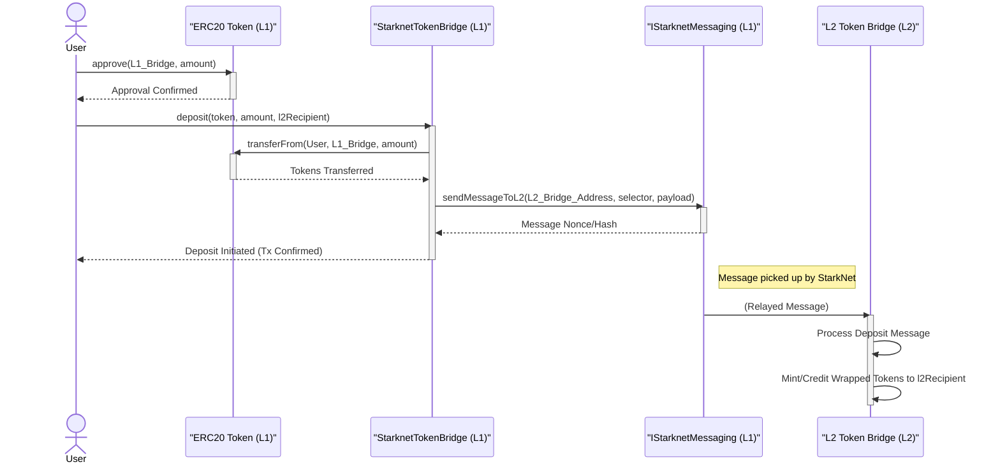

```mermaid
sequenceDiagram
    actor User
    participant L1_ERC20 as "ERC20 Token (L1)"
    participant L1_Bridge as "StarknetTokenBridge (L1)"
    participant L1_Messaging as "IStarknetMessaging (L1)"
    participant L2_Bridge as "L2 Token Bridge (L2)"

    User->>L1_ERC20: approve(L1_Bridge, amount)
    activate L1_ERC20
    L1_ERC20-->>User: Approval Confirmed
    deactivate L1_ERC20

    User->>L1_Bridge: deposit(token, amount, l2Recipient)
    activate L1_Bridge
    L1_Bridge->>L1_ERC20: transferFrom(User, L1_Bridge, amount)
    activate L1_ERC20
    L1_ERC20-->>L1_Bridge: Tokens Transferred
    deactivate L1_ERC20
    L1_Bridge->>L1_Messaging: sendMessageToL2(L2_Bridge_Address, selector, payload)
    activate L1_Messaging
    L1_Messaging-->>L1_Bridge: Message Nonce/Hash
    deactivate L1_Messaging
    L1_Bridge-->>User: Deposit Initiated (Tx Confirmed)
    deactivate L1_Bridge

    %% Off-chain: Message relay to L2 %%
    Note right of L1_Messaging: Message picked up by StarkNet
    
    L1_Messaging->>L2_Bridge: (Relayed Message)
    activate L2_Bridge
    L2_Bridge->>L2_Bridge: Process Deposit Message
    L2_Bridge->>L2_Bridge: Mint/Credit Wrapped Tokens to l2Recipient
    deactivate L2_Bridge
```
