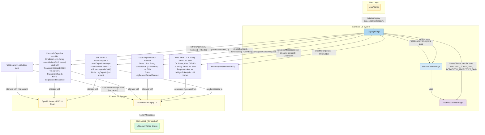

```mermaid
graph TD
    subgraph "User Layer"
        User(User/Caller)
    end

    subgraph "StarkGate L1 System"
        LB[LegacyBridge]
        ParentSTB(StarknetTokenBridge)
        SNS[StarknetTokenStorage]
    end

    subgraph "External L1 Systems"
        BridgedERC20(Specific Legacy ERC20 Token)
        SNM[IStarknetMessaging L1]
    end

    subgraph "StarkNet L2 (Conceptual)"
        L2LegacyBridge(L2 Legacy Token Bridge)
    end

    %% Inheritance
    LB -- "inherits from" --> ParentSTB

    %% Core Functionalities of LegacyBridge (Overrides & New)
    LB -- "deposit(amount, l2Recipient) - Old ABI" --> LB_depositDetail["Uses parent's acceptDeposit & sendDepositMessage\n(Sends NEW format L1->L2 message via SNM)\nEmits LogDeposit (old event)"]
    LB -- "consumeMessage(token, amount, recipient) - Overridden" --> LB_consumeMessageDetail["Tries NEW L2->L1 msg format via SNM\nOn failure, tries OLD L2->L1 msg format via SNM\nRequires token == bridgedToken() for old format"]
    LB -- "legacyDepositCancelRequest(...)" --> LB_legacyCancel["Uses onlyDepositor modifier\nStarts L1->L2 msg cancellation (OLD format) via SNM\nEmits LogDepositCancelRequest"]
    LB -- "legacyDepositReclaim(...)" --> LB_legacyReclaim["Uses onlyDepositor modifier\nFinalizes L1->L2 msg cancellation (OLD format) via SNM\nTransfers BridgedERC20 via parent's transferOutFunds\nEmits LogDepositReclaimed"]
    LB -- "enrollToken(token) - Overridden" --> LB_enrollDetail["Reverts (UNSUPPORTED)"]

    %% Inherited Functionalities (Example - not exhaustive)
    LB -- "withdraw(amount, recipient) - Inherited" --> ParentSTB_withdraw["Uses parent's withdraw logic"]

    %% Interactions
    User -- "Initiates legacy deposit/cancel/reclaim" --> LB

    LB -- "Stores/Reads specific state (BRIDGED_TOKEN_TAG, DEPOSITOR_ADDRESSES_TAG)" --> SNS
    LB -- "Uses parent for general state" --> ParentSTB -- "uses" --> SNS

    LB_depositDetail -- "interacts with" --> BridgedERC20
    LB_depositDetail -- "sends message to" --> SNM
    LB_consumeMessageDetail -- "consumes message from" --> SNM
    LB_legacyCancel -- "interacts with" --> SNM
    LB_legacyReclaim -- "interacts with" --> SNM
    LB_legacyReclaim -- "interacts with" --> BridgedERC20

    ParentSTB_withdraw -- "interacts with (via parent)" --> BridgedERC20
    ParentSTB_withdraw -- "consumes message from (via parent)" --> SNM


    SNM -- "L1-L2 Messaging" --> L2LegacyBridge

    classDef central fill:#AED6F1,stroke:#2980B9
    classDef parent fill:#D6EAF8,stroke:#3498DB
    classDef storage fill:#E8DAEF,stroke:#8E44AD
    classDef external fill:#FEF9E7,stroke:#F1C40F
    classDef l2 fill:#D5F5E3,stroke:#2ECC71
    classDef user fill:#FCF3CF,stroke:#F39C12

    class LB central
    class ParentSTB parent
    class SNS storage
    class BridgedERC20,SNM external
    class L2LegacyBridge l2
    class User user
```
