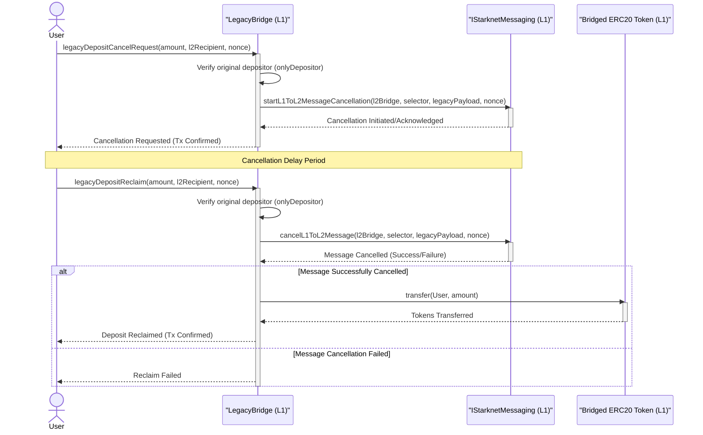

```mermaid
sequenceDiagram
    actor User
    participant L1_LegacyBridge as "LegacyBridge (L1)"
    participant L1_Messaging as "IStarknetMessaging (L1)"
    participant L1_ERC20 as "Bridged ERC20 Token (L1)"

    %% ---- Step A: Request Cancellation ----
    User->>L1_LegacyBridge: legacyDepositCancelRequest(amount, l2Recipient, nonce)
    activate L1_LegacyBridge
    L1_LegacyBridge->>L1_LegacyBridge: Verify original depositor (onlyDepositor)
    L1_LegacyBridge->>L1_Messaging: startL1ToL2MessageCancellation(l2Bridge, selector, legacyPayload, nonce)
    activate L1_Messaging
    L1_Messaging-->>L1_LegacyBridge: Cancellation Initiated/Acknowledged
    deactivate L1_Messaging
    L1_LegacyBridge-->>User: Cancellation Requested (Tx Confirmed)
    deactivate L1_LegacyBridge

    %% ---- Some time passes (cancellation delay) ----
    Note over User, L1_Messaging: Cancellation Delay Period

    %% ---- Step B: Reclaim Funds ----
    User->>L1_LegacyBridge: legacyDepositReclaim(amount, l2Recipient, nonce)
    activate L1_LegacyBridge
    L1_LegacyBridge->>L1_LegacyBridge: Verify original depositor (onlyDepositor)
    L1_LegacyBridge->>L1_Messaging: cancelL1ToL2Message(l2Bridge, selector, legacyPayload, nonce)
    activate L1_Messaging
    L1_Messaging-->>L1_LegacyBridge: Message Cancelled (Success/Failure)
    deactivate L1_Messaging

    alt Message Successfully Cancelled
        L1_LegacyBridge->>L1_ERC20: transfer(User, amount)
        activate L1_ERC20
        L1_ERC20-->>L1_LegacyBridge: Tokens Transferred
        deactivate L1_ERC20
        L1_LegacyBridge-->>User: Deposit Reclaimed (Tx Confirmed)
    else Message Cancellation Failed
        L1_LegacyBridge-->>User: Reclaim Failed
    end
    deactivate L1_LegacyBridge
```
