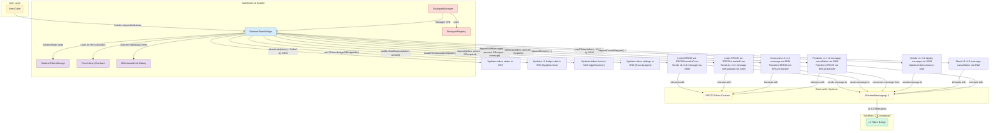

```mermaid
graph TD
    subgraph "User Layer"
        User(User/Caller)
    end

    subgraph "StarkGate L1 System"
        STB[StarknetTokenBridge]
        SGM[StarkgateManager]
        REG[StarkgateRegistry]
        SNS[StarknetTokenStorage]
        FeesLib[Fees Library/Contract]
        WLLib[WithdrawalLimit Library]
    end

    subgraph "External L1 Systems"
        ERC20(ERC20 Token Contract)
        SNM[IStarknetMessaging L1]
    end

    subgraph "StarkNet L2 (Conceptual)"
        L2Bridge(L2 Token Bridge)
    end

    %% Core Functionalities of StarknetTokenBridge
    STB -- "deposit(token, amount, l2Recipient)" --> STB_depositDetail["Locks ERC20 via ERC20.transferFrom\nSends L1->L2 message via SNM"]
    STB -- "depositWithMessage(token, amount, l2Recipient, message)" --> STB_depositMsgDetail["Locks ERC20 via ERC20.transferFrom\nSends L1->L2 message with payload via SNM"]
    STB -- "withdraw(token, amount, recipient)" --> STB_withdrawDetail["Consumes L2->L1 message via SNM\nTransfers ERC20 via ERC20.transfer"]
    STB -- "enrollToken(token) - Called by SGM" --> STB_enrollDetail["Sends L1->L2 deploy message via SNM\nUpdates token status in SNS"]
    STB -- "deactivate(token) - Called by SGM" --> STB_deactivateDetail["Updates token status in SNS"]
    STB -- "setL2TokenBridge(l2BridgeAddr)" --> STB_setL2Detail["Updates L2 bridge addr in SNS (AppGovernor)"]
    STB -- "setMaxTotalBalance(token, amount)" --> STB_setLimitsDetail["Updates token limits in SNS (AppGovernor)"]
    STB -- "enableWithdrawalLimit(token)" --> STB_enableWLLimit["Updates token settings in SNS (SecurityAgent)"]
    STB -- "depositCancelRequest(...)" --> STB_cancelReq["Starts L1->L2 message cancellation via SNM"]
    STB -- "depositReclaim(...)" --> STB_reclaim["Finalizes L1->L2 message cancellation via SNM\nTransfers ERC20 via ERC20.transfer"]

    %% Interactions
    User -- "Initiates deposit/withdraw" --> STB
    
    SGM -- "Manages STB" --> STB
    SGM -- "Uses" --> REG

    STB -- "Stores/Reads state" --> SNS
    STB -- "Uses for fee calculation" --> FeesLib
    STB -- "Uses for withdrawal limits" --> WLLib
    
    STB_depositDetail -- "interacts with" --> ERC20
    STB_depositDetail -- "sends message to" --> SNM
    STB_depositMsgDetail -- "interacts with" --> ERC20
    STB_depositMsgDetail -- "sends message to" --> SNM
    STB_withdrawDetail -- "consumes message from" --> SNM
    STB_withdrawDetail -- "interacts with" --> ERC20
    STB_enrollDetail -- "sends message to" --> SNM
    STB_cancelReq -- "interacts with" --> SNM
    STB_reclaim -- "interacts with" --> SNM
    STB_reclaim -- "interacts with" --> ERC20

    SNM -- "L1-L2 Messaging" --> L2Bridge

    classDef central fill:#D6EAF8,stroke:#3498DB
    classDef manager fill:#FADBD8,stroke:#C0392B
    classDef storage fill:#E8DAEF,stroke:#8E44AD
    classDef external fill:#FEF9E7,stroke:#F1C40F
    classDef l2 fill:#D5F5E3,stroke:#2ECC71
    classDef user fill:#FCF3CF,stroke:#F39C12

    class STB central
    class SGM,REG manager
    class SNS,FeesLib,WLLib storage
    class ERC20,SNM external
    class L2Bridge l2
    class User user
```
