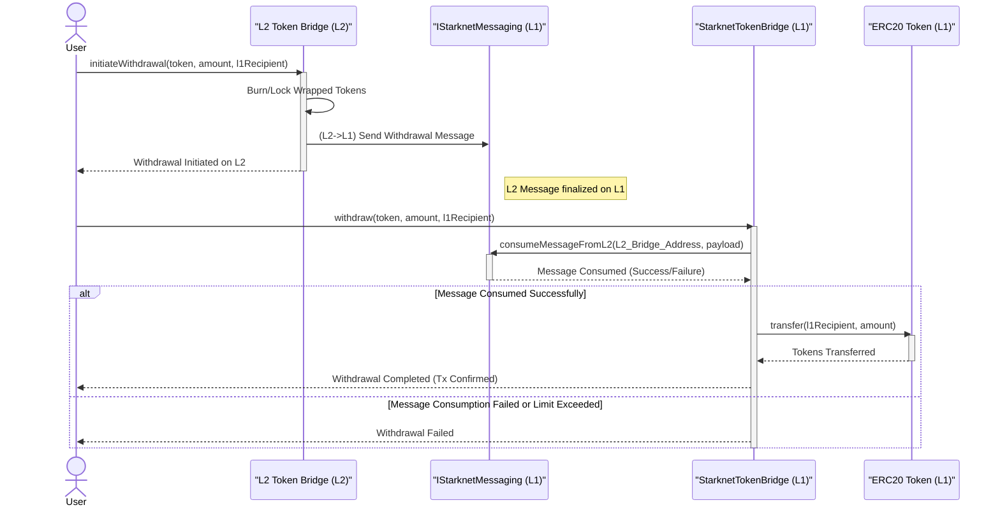

```mermaid
sequenceDiagram
    actor User
    participant L2_Bridge as "L2 Token Bridge (L2)"
    participant L1_Messaging as "IStarknetMessaging (L1)"
    participant L1_Bridge as "StarknetTokenBridge (L1)"
    participant L1_ERC20 as "ERC20 Token (L1)"

    User->>L2_Bridge: initiateWithdrawal(token, amount, l1Recipient)
    activate L2_Bridge
    L2_Bridge->>L2_Bridge: Burn/Lock Wrapped Tokens
    L2_Bridge->>L1_Messaging: (L2->L1) Send Withdrawal Message
    L2_Bridge-->>User: Withdrawal Initiated on L2
    deactivate L2_Bridge

    %% Off-chain: Message relay to L1 & finalization %%
    Note right of L1_Messaging: L2 Message finalized on L1
    
    User->>L1_Bridge: withdraw(token, amount, l1Recipient)
    activate L1_Bridge
    L1_Bridge->>L1_Messaging: consumeMessageFromL2(L2_Bridge_Address, payload)
    activate L1_Messaging
    L1_Messaging-->>L1_Bridge: Message Consumed (Success/Failure)
    deactivate L1_Messaging
    
    alt Message Consumed Successfully
        L1_Bridge->>L1_ERC20: transfer(l1Recipient, amount)
        activate L1_ERC20
        L1_ERC20-->>L1_Bridge: Tokens Transferred
        deactivate L1_ERC20
        L1_Bridge-->>User: Withdrawal Completed (Tx Confirmed)
    else Message Consumption Failed or Limit Exceeded
        L1_Bridge-->>User: Withdrawal Failed
    end
    deactivate L1_Bridge
```
